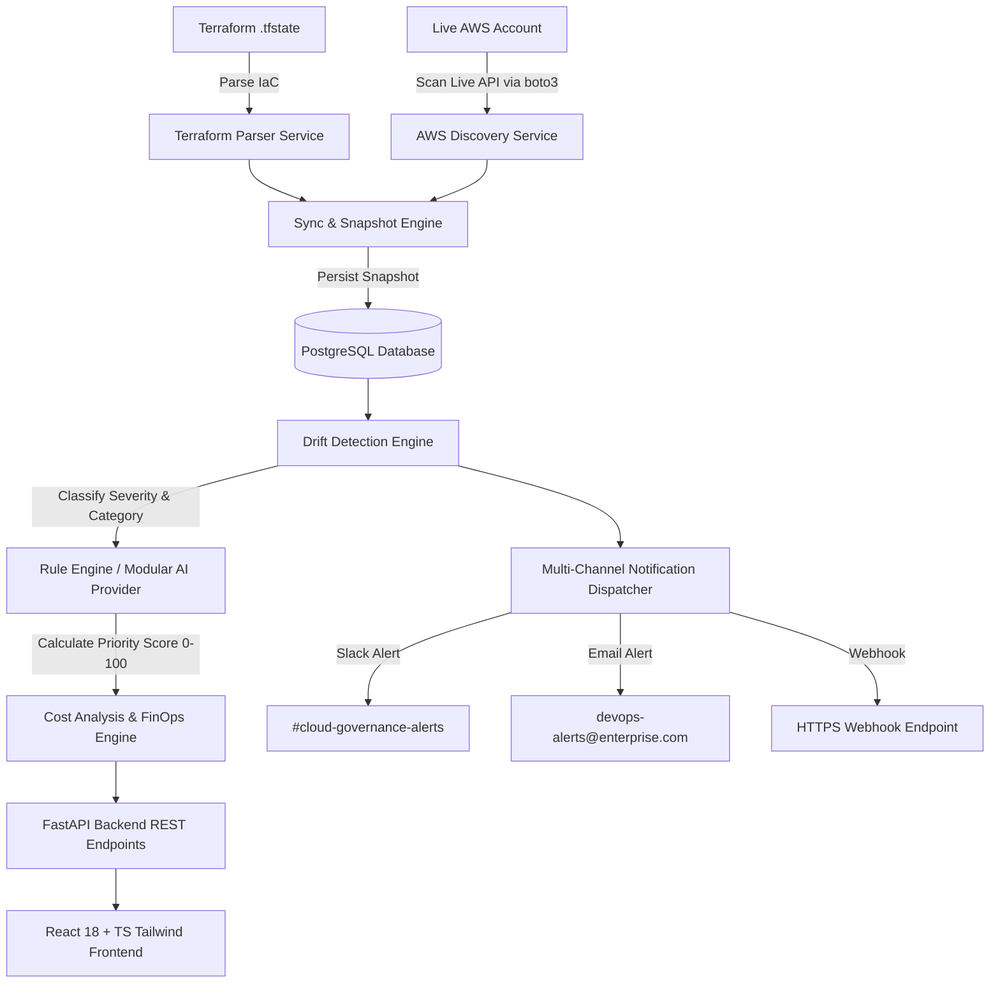

# Infrastructure Drift Detector

> **An intelligent cloud governance platform that continuously detects configuration drift between Infrastructure as Code (IaC) and actual cloud infrastructure, analyzes security and cost impact, prioritizes issues using AI, and provides actionable remediation recommendations.**

---

## 🎯 Architecture Diagram



---

## ✨ Features Highlight

- **Multi-Category Drift Detection**:
  - **Configuration Drift**: Attribute value mismatches (EC2 types, S3 encryption, DB versions).
  - **Security Drift**: Open ingress ports (e.g. 0.0.0.0/0 on port 22/3389) and unencrypted storage.
  - **IAM Drift**: Unmanaged roles or attached wildcard `*` / `AdministratorAccess` permissions.
  - **Networking Drift**: Unmanaged security groups, modified VPC CIDR blocks, subnet attribute changes.
  - **Missing & Unmanaged Resources**: Identifies infrastructure declared in Terraform state but absent in cloud, or manually created console resources.
- **Resource Inventory Module (8 Core Categories)**:
  - EC2 Instances, Security Groups, IAM Roles/Policies, VPCs, Subnets, Load Balancers (ALB/ELB), Databases (RDS PostgreSQL), S3 Buckets.
- **Modular AI & Priority Scoring**:
  - Abstract AI Provider Factory (`BaseAIRecommendationProvider`) supporting `RuleEngineAIProvider` initially, designed for zero-breaking-change swap to LLMs (OpenAI / Gemini / Anthropic).
  - Dynamic Priority Risk Score (0 - 100).
  - Executable Fix Code snippets (AWS CLI & Terraform 1-click copy).
- **FinOps Cost Analytics**:
  - Total Monthly Exposure ($/month), Unmanaged Waste calculation, and potential monthly savings.
- **Background Scheduler & Notifications**:
  - Periodic automated drift scans (`APScheduler`) at configurable intervals (15m, 30m, 1h, 6h, 12h, 24h).
  - Multi-channel notification alerts (Slack, Email, Webhooks).
- **Compliance Scorecards**:
  - Evaluates readiness across **SOC 2 Type II**, **CIS AWS Foundations Benchmark**, **ISO 27001**, and **HIPAA**.
- **Export Reports Engine**:
  - Downloadable CSV audit reports and formatted HTML/PDF executive documentation.

---

## 🛠️ Technology Stack

### Backend
- **Framework**: FastAPI (Python 3.11)
- **Database**: PostgreSQL 15 + SQLAlchemy 2.0 ORM + Alembic
- **Validation**: Pydantic v2 & `pydantic-settings`
- **Security & Auth**: JWT Bearer Authentication (`python-jose`, `passlib`, `bcrypt`), Security Headers, IP Rate Limiter
- **Cloud SDK**: `boto3` (AWS SDK)
- **Scheduler**: `APScheduler`

### Frontend
- **Framework**: React 18 + TypeScript + Vite
- **Styling**: Tailwind CSS + Lucide Icons
- **State & Router**: React Router v6, React Query (`@tanstack/react-query`), Axios

---

## 📑 API Endpoint Documentation Reference

| Method | Endpoint | Description |
| :--- | :--- | :--- |
| `POST` | `/api/v1/auth/register` | Register new platform account |
| `POST` | `/api/v1/auth/login` | Authenticate user & issue JWT token |
| `GET` | `/api/v1/auth/me` | Fetch authenticated user profile |
| `GET` | `/api/v1/resources` | Query resource inventory (Filters: type, region, managed) |
| `GET` | `/api/v1/resources/metrics` | Inventory summary analytics |
| `POST` | `/api/v1/resources/seed-demo` | Seed sample enterprise cloud inventory |
| `POST` | `/api/v1/sync/run` | Execute Terraform parsing + AWS SDK live discovery sync |
| `POST` | `/api/v1/drift/analyze` | Execute Drift Detection Engine |
| `GET` | `/api/v1/drift/events` | List drift events with category & severity filters |
| `GET` | `/api/v1/drift/compare/{event_id}` | Fetch side-by-side JSON attribute diff |
| `POST` | `/api/v1/recommendations/generate` | Run AI Recommendation Engine |
| `GET` | `/api/v1/recommendations/cost-analysis` | FinOps monthly waste breakdown |
| `GET` | `/api/v1/monitoring/dashboard` | System monitoring metrics (Last/Next scan, alerts sent) |
| `PUT` | `/api/v1/monitoring/scheduler` | Update scan interval frequency (mins) |
| `GET` | `/api/v1/analytics/trends` | Historical drift time-series trend buckets |
| `GET` | `/api/v1/analytics/compliance` | SOC 2, CIS Benchmark, ISO 27001, HIPAA scorecards |
| `GET` | `/api/v1/analytics/export/csv` | Download CSV audit report |
| `GET` | `/api/v1/analytics/export/pdf` | Download PDF executive report |

---

## ⚡ Deployment Guide (Docker Compose)

### 1. Clone & Set Environment
```bash
git clone https://github.com/abdulrahmanrifayath/Infrastructure-Drift-Detector.git
cd Infrastructure-Drift-Detector
cp .env.example .env
```

### 2. Start Services
```bash
docker-compose up --build -d
```
- **Frontend Workspace UI**: `http://localhost:5173`
- **Backend API Base**: `http://localhost:8000/api/v1/health`
- **Interactive Swagger OpenAPI Docs**: `http://localhost:8000/api/v1/docs`

---

## 🔮 Future Roadmap

- **Azure & GCP Discovery Providers**: Extend Clean Architecture repository providers for Azure Resource Manager and GCP Cloud Asset Inventory.
- **Kubernetes (k8s) Manifest Drift**: Detect drift between GitOps Helm charts and live k8s cluster resources.
- **Native LLM Integration**: Connect OpenAI GPT-4 / Google Gemini API keys into `AIRecommendationFactory` for generative remediation scripts.

---

## 🛡️ License

Distributed under the MIT License.
